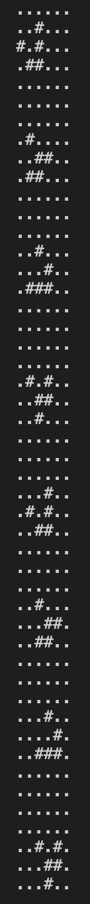

# Game-of-life
Implementation of Conway's Game of Life in Haskell

## Description
This project implements Conway's Game of Life, a cellular automaton devised by the British mathematician John Horton Conway in 1970. The game is a zero-player game, meaning that its evolution is determined by its initial state, requiring no further input. One interacts with the Game of Life by creating an initial configuration and observing how it evolves.

### Key Functions:
- **`pretty`**: Converts a 3D list of characters (representing a grid) into a single string by concatenating lines together with newline characters.
- **`glider`**: Initial configuration of the glider pattern in Conway's Game of Life.
- **`visualisation`**: Function to generate a visual representation of the Game of Life grid over multiple generations.
- **`evolution`**: Function that generates successive generations of the Game of Life based on the rules of the game.
- **`main`**: The main function that prints the visual representation of the Game of Life for the initial glider pattern.

## How to Run

### Prerequisites
Make sure you have the Glasgow Haskell Compiler (GHC) installed on your system. You can download it from the [Haskell website](https://www.haskell.org/downloads/).

### Compilation and Execution
1. Open a terminal and navigate to the directory containing the `GameOfLife.hs` file.
2. Compile the Haskell file using GHC:
   ```bash
   ghc GameOfLife.hs -o GameOfLife
   ```
3. Then run it using:
   ```bash
   ./GameOfLife.hs
   ```
   
## Example Output
Here is an example output of the Game of Life with the initial glider pattern:


